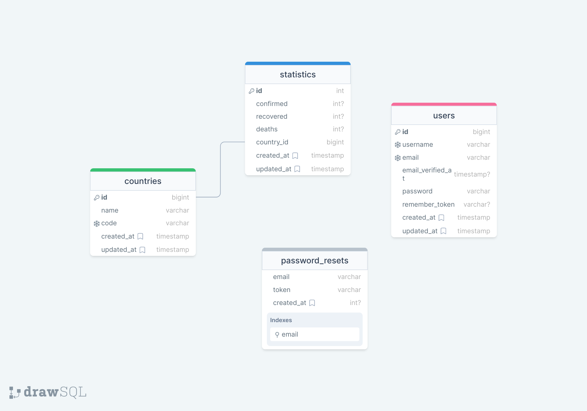

# Denis Coronatime

#

## Table of Contents

* [Prerequisites](#prerequisites)
* [Getting Started](#getting-started)
* [Configuration](#configuration)
* [Development](#development)
* [Running Tests](#running-tests)
* [Database Structure](#database-structure)

#

## Prerequisites

* _PHP@8.1 and up_
* _composer@2.4 and up_
* _npm@6.14 and up_
* _MYSQL@8 and up_

#

## Getting Started

1. Clone the repository from GitHub:
    ```shell
      git clone https://github.com/RedberryInternship/denis-coronatime.git
      cd denis-coronatime
    ```
2. Install PHP dependencies:
    ```shell
      composer install
    ```
3. Install JS dependencies:
    ```shell
      npm install
    ```
4. Create the `.env` file and generate an Application Key:
    ```shell
      cp .env.example .env
      php artisan key:generate
    ```

#

## Configuration

1. Modify the default database configuration in your `.env` file:
   > DB_CONNECTION=mysql <br>
   DB_HOST=127.0.0.1 <br>
   DB_PORT=3306 <br>
   DB_DATABASE=coronatime <br>
   DB_USERNAME=<your_username> <br>
   DB_PASSWORD=<your_password> <br>

2. Modify mail configuration in your `.env` file:
   > MAIL_MAILER=&lt;mailer&gt; <br>
   MAIL_HOST=&lt;example.com&gt; <br>
   MAIL_PORT=&lt;0000&gt; <br>
   MAIL_USERNAME=&lt;your_username&gt; <br>
   MAIL_PASSWORD=&lt;password&gt; <br>
   MAIL_ENCRYPTION=&lt;your_password&gt; <br>

3. Run database migrations with `seed` parameter to populate the db with Countries:

```shell
    php artisan migrate --seed
```

#

## Development

You need to start both Laravel and Vite servers:

```shell
    php artisan serve
```

```shell
    npm run dev
```

###

Reformat `.php` files after any changes using PHP Coding Standards Fixer:

```shell
    composer format-all
```

...or set up your IDE to reformat files automatically with rules defined inside `.php-cs-fixer.php`

#

## Running Tests

You can run tests by executing:
```shell
    php artisan test
```

The `UpdateStatisticsCommandTest` is using fake Http requests by default. You test with actual requests by setting the
`INCLUDE_EXTERNAL_API_CALLS` environment variable to `true`:

```shell
    INCLUDE_EXTERNAL_API_CALLS=true php artisan test
```

**Note:** make sure that the app is built with `npm run build` or that `npm run dev` is running before running tests.

#

## Database Structure

[DrawSQL Diagram](https://drawsql.app/teams/team-denis/diagrams/coronatime)


